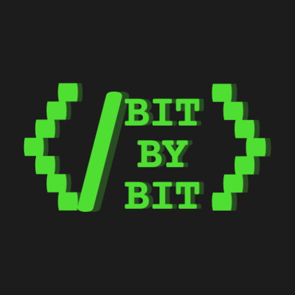

# 🧠 BitByBit - Master DSA, One Topic at a Time

<div align="center">
  
  
  [](https://reactjs.org/)
  [](https://firebase.google.com/)
  [](https://vitejs.dev/)
  [](LICENSE)
  
  **A modern, interactive DSA practice platform with 3113+ LeetCode questions organized by topics**
  
  [🚀 Live Demo](#) | [📖 Documentation](#features) | [🐛 Report Bug](#contributing)
</div>

---

## ✨ Features

### 🎯 **Smart Organization**
- **16 comprehensive DSA topics** covering everything from Arrays to Advanced Topics
- **Subtopic breakdown** with focused question sets for targeted practice
- **3113+ verified LeetCode questions** with authentic URLs
- **Zero repetition** - each question appears only once in its most relevant topic

### 📊 **Progress Tracking**
- **Individual question checkboxes** for granular progress tracking
- **Subtopic completion** with visual progress bars
- **Overall progress dashboard** showing your DSA mastery journey
- **Real-time progress sync** across all devices

### ☁️ **Cloud Sync & Authentication**
- **Firebase Authentication** with Google Sign-In
- **Cross-device synchronization** - never lose your progress
- **Offline support** with local storage fallback
- **Automatic data migration** to latest question sets

### 🎨 **Modern UI/UX**
- **Dark theme** optimized for long coding sessions
- **Responsive design** works perfectly on desktop, tablet, and mobile
- **Smooth animations** and intuitive interactions
- **LeetCode profile integration** (optional)

---

## 🏗️ Tech Stack

<div align="center">

| Frontend | Backend | Tools |
|----------|---------|--------|
|  |  |  |
|  |  |  |
|  |  |  |

</div>

---

## 🚀 Quick Start

### Prerequisites
- Node.js (v16 or higher)
- npm or yarn
- Firebase account (for authentication features)

### Installation

1. **Clone the repository**
   ```bash
   git clone https://github.com/yourusername/bitbybit.git
   cd bitbybit
   ```

2. **Install dependencies**
   ```bash
   npm install
   ```

3. **Set up Firebase** (Optional - for cloud sync)
   ```bash
   # Create a Firebase project at https://console.firebase.google.com
   # Copy your config to src/firebase/config.js
   ```

4. **Start the development server**
   ```bash
   npm run dev
   ```

5. **Open your browser**
   ```
   http://localhost:5173
   ```

---

## 📚 DSA Topics Covered

<details>
<summary><strong>🔢 Core Topics (Click to expand)</strong></summary>

| Topic | Subtopics | Questions |
|-------|-----------|-----------|
| **Arrays** | Two Pointers, Sliding Window, Prefix Sum, Binary Search | 195 |
| **Strings** | Pattern Matching, Palindromes, Anagrams, Parsing | 195 |
| **Linked Lists** | Traversal, Reversal, Cycle Detection, Merging | 195 |
| **Trees** | Binary Trees, BST, Traversals, Tree DP | 195 |
| **Graphs** | DFS/BFS, Shortest Path, Topological Sort, Union Find | 195 |
| **Dynamic Programming** | 1D DP, 2D DP, Optimization, Game Theory | 195 |

</details>

<details>
<summary><strong>⚡ Advanced Topics (Click to expand)</strong></summary>

| Topic | Subtopics | Questions |
|-------|-----------|-----------|
| **Advanced Topics** | Segment Trees, Fenwick Trees, Mo's Algorithm | 150 |
| **System Design** | Scalability, Caching, Load Balancing | 195 |
| **Math & Logic** | Number Theory, Combinatorics, Probability | 195 |
| **Bit Manipulation** | XOR, Masks, Bit Tricks | 195 |

</details>

---

## 🎮 Usage

### 🏁 Getting Started
1. **Browse Topics**: Explore 16 comprehensive DSA topics
2. **Pick a Subtopic**: Focus on specific areas like "Two Pointers" or "Binary Search"
3. **Track Progress**: Check off questions as you solve them
4. **Sync Everywhere**: Sign in to sync progress across devices

### 💡 Pro Tips
- Start with **Arrays** and **Strings** for fundamental concepts
- Use the **progress bars** to identify areas needing attention
- **Sign in** to never lose your progress
- Check the **LeetCode Profile** section for additional insights

---

## 🤝 Contributing

We love contributions! Here's how you can help make BitByBit even better:

### 🐛 Bug Reports
Found a bug? Please open an issue with:
- Clear description of the problem
- Steps to reproduce
- Expected vs actual behavior
- Browser/device information

### ✨ Feature Requests
Have an idea? We'd love to hear it! Open an issue with:
- Detailed description of the feature
- Use case and benefits
- Any implementation ideas

### 🔧 Development
1. Fork the repository
2. Create a feature branch (`git checkout -b feature/amazing-feature`)
3. Commit your changes (`git commit -m 'Add amazing feature'`)
4. Push to the branch (`git push origin feature/amazing-feature`)
5. Open a Pull Request

---

## 📊 Project Stats

```
📁 Project Structure
├── 16 DSA Topics
├── 95+ Subtopics  
├── 3113+ LeetCode Questions
├── 100% Authentic URLs
└── 0% Question Repetition
```

---

## 🎯 Roadmap

- [ ] **Contest Integration** - Track LeetCode contest performance
- [ ] **Study Plans** - Curated learning paths for different goals
- [ ] **Social Features** - Share progress with friends
- [ ] **Mobile App** - Native iOS/Android applications
- [ ] **AI Recommendations** - Personalized question suggestions
- [ ] **Video Solutions** - Integrated solution explanations

---

## 📄 License

This project is licensed under the MIT License - see the [LICENSE](LICENSE) file for details.

---

## 👨‍💻 Creator

<div align="center">
  <strong>BitByBit</strong> by <a href="https://www.linkedin.com/in/arya-rathore-0b671528a/">Arya Rathore</a>
  
  [](https://www.linkedin.com/in/arya-rathore-0b671528a/)
  [](#)
</div>

---

## 🙏 Acknowledgments

- **LeetCode** for providing the excellent problem set
- **Firebase** for reliable backend services  
- **React** community for amazing tools and libraries
- **Open source** contributors who make projects like this possible

---

<div align="center">
  <strong>Happy Coding! 🚀</strong>
  
  <sub>Made with ❤️ for the coding community</sub>
</div>
